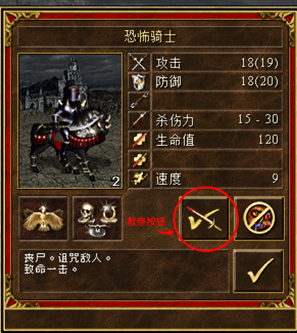
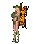
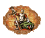
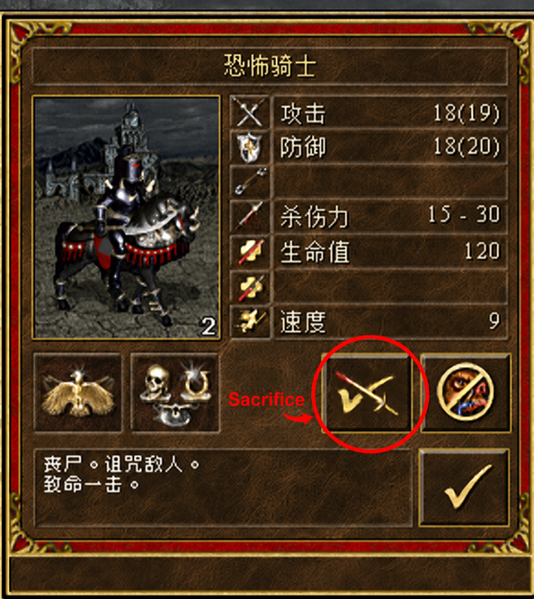

<h1 align="center">英雄无敌3-HOTA-新英雄特长开发专栏<br>Heroes of Might and Magic III: Horn of the Abyss — New Hero Specialty Development</h1>

<p align="center"><sub>点击左侧三角图标，展开对应语言或版权声明的详细内容。<br>Click the triangle icon on the left to expand your preferred language or the copyright notice.</sub></p>

<p align="center">本项目专注于《英雄无敌 III：深渊号角》（HotA）1.8.0 版本的英雄新特长开发、机制研究与实机验证。<br>This project focuses on developing, researching, and playtesting new hero specialties for Heroes of Might and Magic III: Horn of the Abyss (HotA) 1.8.0.</p>

<p align="center"><sub><a href="docs/EXPERIENCE_ACCESS.md">开发经验资料访问与借阅申请 / Development Experience Access Request</a></sub></p>

<details name="section">
<summary><strong>🔴 中文说明</strong></summary>

**当前版本下载：** [HOTA_NEW_HERO_V1.53.zip](https://github.com/TonyUB/hota-hero-specialty-patch/raw/refs/heads/main/Download/HOTA_NEW_HERO_V1.53.zip)&nbsp;&nbsp;&nbsp;&nbsp;**手册下载：** [HOTA_NEW_HERO_V1.52_HERO_HANDBOOK.docx](https://github.com/TonyUB/hota-hero-specialty-patch/raw/refs/heads/main/Manual/HOTA_NEW_HERO_V1.52_HERO_HANDBOOK.docx)

## 奥蕾加

<p>&nbsp;&nbsp;&nbsp;&nbsp;&nbsp;&nbsp;&nbsp;&nbsp;&nbsp;&nbsp;&nbsp;&nbsp;&nbsp;&nbsp;&nbsp;&nbsp;&nbsp;&nbsp;&nbsp;&nbsp;</p>

**英雄简介：** 与传统的战斗法师不同，奥蕾加将全部魔法天赋都用于探索未知的宝物。当克鲁罗德的其他法师在战场上制造毁灭时，她却运用法术来透视王国的贫瘠废土。凭借独有的寻宝术，她总能从荒芜之地发掘出深埋地底的宝藏。

**英雄阵营：** 据点。

**特长效果：** 寻宝术——英雄可以在移动后挖掘，但至少需要 100 点行动力。每次成功挖掘会随机获得一座尚未访问的方尖塔所提供的藏宝图信息，以及奖池中的一项奖励。

**初始兵力：** 20–30 大耳怪 / 5–7 恶狼骑士 / 5–6 半兽人。

**初始指数：** 职业：战斗法师；四维（攻击 / 防御 / 力量 / 知识）：2 / 1 / 1 / 1。

**初始技能：** 初级智慧术 / 初级侦察术。

### 创作难度

★★★★☆（4 / 5）

### 创作方向

移动后挖掘、方尖塔同步、大小保底机制设计。

### 寻宝术使用说明

- [查看奥蕾加寻宝术的完整中英文规则](docs/SPECIAL_MECHANICS.md#奥蕾加寻宝术--olega-treasure-hunt)

---

## 阿萨泽尔

<p>&nbsp;&nbsp;&nbsp;&nbsp;</p>

**英雄简介：** 在被提拔为恶魔将军之前，阿萨泽尔曾是地狱深渊中最冷酷的军械监工。在他看来，血肉注定会衰败，钢铁与烈火才是最可靠的毁灭手段。阿萨泽尔在战争机器的制造与运用上有着非凡天赋，并因此在地狱军中迅速崭露头角。经他改良的攻城器械不仅能摧毁坚固的城防，也能在野战中撕开最严密的阵线。

**英雄阵营：** 地狱。

**特长效果：** 战争机器——弩车、加农炮和投石车每次原生行动额外射击 1 次；胜利后修复战前拥有且被摧毁的战争机器。补给车存活且英雄至少掌握初级弹道术时，普通射手、弩车和加农炮攻击力 +4；补给车每次物理命中最多损失当前最大生命值的 40%。中级及以上炮术使弩车和加农炮攻击部队时按 50% 有效防御结算；高级炮术还使其无视射程与城墙惩罚。同时掌握高级弹道术和高级炮术时，战争机器按逻辑优先级行动。

**初始兵力：** 20–30 小恶魔 / 4–5 地狱猎犬；携带弩车和补给车。

**初始指数：** 职业：大魔鬼；四维（攻击 / 防御 / 力量 / 知识）：2 / 2 / 1 / 1。

**初始技能：** 初级弹道术 / 初级炮术；无魔法书与初始法术。

### 创作难度

★★★★★（5 / 5）

### 创作方向

战争机器行动链扩展、战后修复与动态增益、补给车伤害边界、炮术防御与距离规则、双高级技能逻辑行动优先级，以及头像、特长图集和动态说明的完整整合。

### 战争机器使用说明

- [查看阿萨泽尔战争机器特长的完整中英文规则](docs/SPECIAL_MECHANICS.md#阿萨泽尔战争机器--azazel-war-machines)

---

## 厄瑞玻斯

<a href="assets/ui/erebus-sacrifice-window-annotated.png"></a>

<p>&nbsp;&nbsp;&nbsp;&nbsp;&nbsp;&nbsp;&nbsp;&nbsp;&nbsp;&nbsp;&nbsp;&nbsp;&nbsp;&nbsp;&nbsp;&nbsp;&nbsp;&nbsp;&nbsp;&nbsp;</p>

**特殊功能详解：**  [查看献祭的完整允许范围、禁止范围与实现边界](docs/SPECIAL_MECHANICS.md#破灭重塑--ruinous-reforging)

**英雄简介：** 厄瑞玻斯是远古时代最早诞生的纯血黑龙之一。他自愿拥抱死亡并凭借自身意志重生，成为世间第一位鬼龙之王。环绕其身的破灭之力扭曲了死灵法则，在他的威压下，普通亡灵的骨骸会崩解重组，化作令人胆寒的骨龙为他而战。

**英雄阵营：** 墓园。

**特长效果：** 破灭重塑——允许英雄将麾下的1—6级墓园亡灵单位重塑为骨龙。当军中存在龙族单位时，非龙单位无法加入战斗。单支部队可生成的骨龙数量为：`部队数量 × 兵种基础生命值 ÷（240 × 等级倍率）`（向下取整）。

**初始兵力：** 1 骨龙。

**初始指数：** 职业：死亡骑士；四维（攻击 / 防御 / 力量 / 知识）：1 / 2 / 2 / 1。

**初始技能：** 中级招魂术；魔法书自带悲泣。

### 创作难度

★★★★★（5 / 5）

### 创作方向

兵种转换框架设计、基础生命值献祭结算、自定义按钮设计、HotA/HD 双运行路径的兼容适配。

### 破灭重塑使用说明

- 等级倍率按来源兵种等级计算：1级 2.0、2级 1.8、3级 1.6、4级 1.4、5级 1.2、6级 1.0；对应生命门槛为 `240 × 等级倍率`。
- 仅能在冒险地图中厄瑞玻斯自己的英雄军队兵种信息窗使用；战斗、城镇驻军及另一名英雄的军队不能直接献祭。
- 可献祭墓园 1—6 级基础及升级兵种；骨龙、鬼龙及其他不在白名单中的生物不能献祭。
- 只读取兵种数据库基础生命值，不计算生命类宝物、血瓶、急救术或其他临时加成。
- 结果在原兵槽生成，不需要空余兵槽，也不自动与已有骨龙合并；生命值余数会被舍弃。
- 结果为 0、来源不合格或取消操作时，部队保持不变。
- 厄瑞玻斯的原升级按钮已专用于献祭；如需普通城镇升级，请先把部队交给其他英雄。
- 按钮、右键说明、确认弹窗和结算均正常。
- 龙族范围与“龙之血瓶”一致：绿龙、金龙、骨龙、鬼龙、红龙、黑龙、圣龙、水晶龙、魔法龙、毒龙。
- 当军中至少存在一队龙族时，只有上述龙族能够进入战场；非龙单位仍可随身携带。获胜后未参战单位原位保留，失败、撤退或投降时不恢复。
- 当军中至少存在一队龙族时，每日陆地移动力只按龙族部队的原生速度标准计算；多队龙族仍由最慢的一队决定。后勤术、宝物、马厩、地形等修正保持原生结算。
- 军中完全没有龙族时，两项限制均不启用：全部部队正常出战，移动力按原生全军规则计算。
- 厄瑞玻斯初次登场及隔周正常刷新到酒馆时携带 1 骨龙；战败或逃跑后在当周酒馆返场时仅携带 1 骷髅兵；投降按原生规则保留全部兵力。

---

## 治愈特长英雄

### 尤兰德

<p>&nbsp;&nbsp;&nbsp;&nbsp;&nbsp;&nbsp;&nbsp;&nbsp;&nbsp;&nbsp;&nbsp;&nbsp;&nbsp;&nbsp;&nbsp;&nbsp;&nbsp;&nbsp;&nbsp;&nbsp;</p>

**英雄简介：** 尤兰德在选择德鲁伊之路前，曾在战场上做过大量的治疗工作，他在军队里学到的经验使他成为了今天出色的领导者。

**英雄阵营：** 壁垒。

**特长效果：** 治愈魔法可以永久复活友方单位。施放治愈时，英雄等级每增加（8−n）级，效果提高10%，其中 n 为目标生物等级。

**初始兵力：** 12–24 半人马 / 5–7 矮人 / 2–4 木精灵。

**初始指数：** 职业：德鲁伊；四维（攻击 / 防御 / 力量 / 知识）：0 / 2 / 1 / 2。

**初始技能：** 初级智慧术 / 初级弹道术；魔法书自带治愈。

### 阿斯特拉

<p>&nbsp;&nbsp;&nbsp;&nbsp;&nbsp;&nbsp;&nbsp;&nbsp;&nbsp;&nbsp;&nbsp;&nbsp;&nbsp;&nbsp;&nbsp;&nbsp;&nbsp;&nbsp;&nbsp;&nbsp;</p>

**英雄简介：** 阿斯特拉从不急着向别人说起她的往事，以至于很少有人知道她的来历。但谁都知道她为了学到神秘的水系魔法几乎访问了这片大陆所有的地方。后来她成为了海洋女祭司，在这里实现了精通水系魔法的夙愿。

**英雄阵营：** 港口。

**特长效果：** 治愈魔法可以永久复活友方单位。施放治愈时，英雄等级每增加（8−n）级，效果提高10%，其中 n 为目标生物等级。

**初始兵力：** 15–25 泉水精灵 / 6–9 水手 / 4–7 海贼。

**初始指数：** 职业：领航员；四维（攻击 / 防御 / 力量 / 知识）：2 / 0 / 1 / 2。

**初始技能：** 初级智慧术 / 初级水系魔法；魔法书自带治愈。

### 创作难度

★★★★☆（4 / 5）

### 创作方向

原创魔法效果、永久复活结算与新魔法机制开发。

### 当前治疗量公式

```text
B = 5P + 10 + 10 × max(0, clamp(w, 0, 3) - 1)
H = HotA 1.8.0 原生结算：每达到一个完整的 (8−n) 英雄等级区间，
    在 B 的基础上提高 10%
```

其中 `H` 为最终治疗/复活生命值，`B` 为 HotA 1.8.0 原生治愈基础值，`P` 为英雄当前有效力量，`n` 为目标生物等级（限定为 1–7），`w` 为水系魔法熟练度（无/初级/中级/高级分别取 0/1/2/3）。等级增幅与最终整数取整均直接调用 HotA 1.8.0 原生特长计算；单体/群体施法范围规则保持不变。

### 治愈复活使用说明

- 永久复活仅属于尤兰德与阿斯特拉；其他英雄使用治愈术时保持原生治疗效果，不能复活完整尸体。
- 遵循原生治愈术的友方目标判定，可治疗存活部队，并复活符合条件的己方阵亡非亡灵部队；阵亡亡灵不会被该特长复活。
- 存活的战争机器仍按原生治愈规则接受治疗并使用上述原生数值；被摧毁的战争机器不会被专属永久复活路径重新生成。
- 复活兵力在战斗结束后永久保留。水系魔法仍按原生规则决定单体或群体施法，并通过公式中的 `w` 项影响治疗量。
- 完整尸体必须处于可选择状态；尸体所在格被其他部队占据时不能复活。同格重叠多个尸体时，一次只能复活当前可选中的一队。
- 保留治愈的原版动画与音效，并补充复活起身动作；不会播放转世重生的法术动画与音效。
- 战斗日志先记录施放治愈，再显示治疗量和复活结果；群体施法会逐队列出所有有效受疗单位。
- 魔法书显示当前条件下对 1—7 级生物的治疗量范围；存活目标悬停显示精确治疗量；尸体悬停保留原生“治愈”文字。
- 敌方、原生非法目标、被占据而不可选择的尸体，以及其他英雄的治愈术均不获得尸体复活效果。
- [查看治愈机制完整中英文规则](docs/SPECIAL_MECHANICS.md#治愈复活--cure-resurrection)

---

## 埃尔芙

<p>&nbsp;&nbsp;&nbsp;&nbsp;</p>

**英雄简介：** 埃尔芙是妖精一族的女王，她的名字长久以来只存在于吟游诗人的古老歌谣中。她以绝世容貌与卓越的战术才能闻名。当埃拉西亚陷入危难时，她打破避世誓言，响应元素城的召唤，亲率部众为这片大陆而战。

**英雄阵营：** 元素城。

**特长效果：** 仙灵和妖精杀伤力 +1，速度 +1。

**初始兵力：** 25 仙灵 / 25 仙灵 / 25 仙灵。

**初始指数：** 职业：位面行者；四维（攻击 / 防御 / 力量 / 知识）：3 / 1 / 1 / 1。

**初始技能：** 初级战术 / 初级进攻术。

### 创作难度

★★★☆（3.5 / 5）

### 创作方向

项目开始之地，一切原创英雄的技术路线奠基；新兵种特长设计、战斗动画抓帧提取与全新英雄立绘创作。

---

## 幸运特长英雄

### 马洛迪亚

<p>&nbsp;&nbsp;&nbsp;&nbsp;&nbsp;&nbsp;&nbsp;&nbsp;&nbsp;&nbsp;&nbsp;&nbsp;&nbsp;&nbsp;&nbsp;&nbsp;&nbsp;&nbsp;&nbsp;&nbsp;</p>

**英雄简介：** 马洛迪亚也许不是埃里技艺最精湛的德鲁伊，但她肯定是最幸运的德鲁伊。即使面对难以克服的困难，她也能奇迹般地取得胜利。在她率领的军队中，士兵们都乐意为她效命。

**英雄阵营：** 壁垒。

**特长效果：** 英雄所率领部队的幸运值始终为 +3，且每支部队在每场战斗中首次主动攻击时必定触发幸运。

**初始兵力：** 12–24 半人马 / 5–7 矮人 / 2–4 木精灵。

**初始指数：** 职业：德鲁伊；四维（攻击 / 防御 / 力量 / 知识）：0 / 2 / 1 / 2。

**初始技能：** 初级智慧术 / 初级领导术；魔法书自带振奋。

### 黛瑞丝

<p>&nbsp;&nbsp;&nbsp;&nbsp;&nbsp;&nbsp;&nbsp;&nbsp;&nbsp;&nbsp;&nbsp;&nbsp;&nbsp;&nbsp;&nbsp;&nbsp;&nbsp;&nbsp;&nbsp;&nbsp;</p>

**英雄简介：** 黛瑞丝早就该死了。她随心所欲、无所不为的态度让她陷入了本不该生还的境地，但不知何故，她却毫发无损。

**英雄阵营：** 塔楼。

**特长效果：** 英雄所率领部队的幸运值始终为 +3，且每支部队在每场战斗中首次主动攻击时必定触发幸运。

**初始兵力：** 30–40 精怪 / 5–7 石像鬼 / 4–5 铁魔像。

**初始指数：** 职业：术士；四维（攻击 / 防御 / 力量 / 知识）：0 / 0 / 2 / 3。

**初始技能：** 初级智慧术 / 初级智力；魔法书自带观天。

### 创作难度

★★★☆☆（3 / 5）

### 额外说明

厄运沙漏、诅咒之地等直接禁止幸运生效的效果仍然有效。

### 创作方向

固定幸运特长、每支部队首次主动攻击必定幸运，以及原生幸运封锁规则兼容。

---

## 学术特长英雄

### 克洛尼斯

<p>&nbsp;&nbsp;&nbsp;&nbsp;&nbsp;&nbsp;&nbsp;&nbsp;&nbsp;&nbsp;&nbsp;&nbsp;&nbsp;&nbsp;&nbsp;&nbsp;&nbsp;&nbsp;&nbsp;&nbsp;</p>

**英雄简介：** 克洛尼斯曾在埃拉西亚的魔法学院中学习过，但他很快就厌倦了那呆板的教学方式，毅然离开学院，到埃里拜一名隐士为师。

**英雄阵营：** 壁垒。

**特长效果：** 学术的效果提升一级；与其他英雄会面时，双方通过智慧术学习魔法的等级上限也提升一级。

**初始兵力：** 12–24 半人马 / 5–7 矮人 / 2–4 木精灵。

**初始指数：** 职业：德鲁伊；四维（攻击 / 防御 / 力量 / 知识）：0 / 2 / 1 / 2。

**初始技能：** 初级智慧术 / 初级学术；魔法书自带屠戮。

### 创作难度

★☆☆☆☆（1 / 5）

### 创作方向

原生辅助技能特长重构与双向英雄交互规则扩展。

[娱乐包下载](https://github.com/TonyUB/hota-hero-specialty-patch/raw/refs/heads/main/Download/HOTA_ENTERTAINMENT_V0.1.zip)&nbsp;&nbsp;&nbsp;&nbsp;[娱乐包将领说明](docs/ENTERTAINMENT_PACK_GENERALS.md#中文说明)

</details>

<details name="section">
<summary><strong>🔵 English Description</strong></summary>

**Current version:** [Download HOTA_NEW_HERO_V1.53.zip](https://github.com/TonyUB/hota-hero-specialty-patch/raw/refs/heads/main/Download/HOTA_NEW_HERO_V1.53.zip)&nbsp;&nbsp;&nbsp;&nbsp;**Handbook:** [Download HOTA_NEW_HERO_V1.52_HERO_HANDBOOK.docx](https://github.com/TonyUB/hota-hero-specialty-patch/raw/refs/heads/main/Manual/HOTA_NEW_HERO_V1.52_HERO_HANDBOOK.docx)

## Orega

<p>&nbsp;&nbsp;&nbsp;&nbsp;&nbsp;&nbsp;&nbsp;&nbsp;&nbsp;&nbsp;&nbsp;&nbsp;&nbsp;&nbsp;&nbsp;&nbsp;&nbsp;&nbsp;&nbsp;&nbsp;</p>

**Hero biography:** Unlike traditional Battle Mages, Orega devotes all of her magical talent to exploring for unknown treasures. While Krewlod's other mages use magic to wreak destruction on the battlefield, she employs her spells to peer beneath the kingdom's barren wastes. With her unique Treasure Hunt specialty, she can always unearth treasures buried deep beneath desolate lands.

**Hero faction:** Stronghold.

**Specialty effect:** Treasure Hunt — the hero may dig after moving, but must retain at least 100 movement points. Each successful dig randomly reveals the treasure-map information granted by one unvisited Obelisk and awards one result from the prize pool.

**Starting army:** 20–30 Goblins / 5–7 Wolf Riders / 5–6 Orcs.

**Initial profile:** Class: Battle Mage; primary skills (Attack / Defense / Power / Knowledge): 2 / 1 / 1 / 1.

**Starting skills:** Basic Wisdom / Basic Scouting.

### Creation Difficulty

★★★★☆ (4 / 5)

### Creative Direction

Digging after movement, synchronized Obelisk state, and dual pity mechanism design.

### Treasure Hunt Guide

- [Read the complete bilingual rules for Orega's Treasure Hunt specialty](docs/SPECIAL_MECHANICS.md#奥蕾加寻宝术--orega-treasure-hunt)

---

## Azazel

<p>&nbsp;&nbsp;&nbsp;&nbsp;</p>

**Biography:** Before his promotion to demon general, Azazel was the most ruthless armaments overseer in the infernal abyss. To him, flesh is destined to decay; steel and fire are the only reliable instruments of destruction. His extraordinary gift for designing and operating war machines carried him rapidly through the infernal ranks. The siege engines he improved can shatter fortified defenses and tear open even the tightest field formations.

**Faction:** Inferno.

**Specialty effect:** War Machines — the Ballista, Cannon, and Catapult fire one additional shot during each native action, and war machines owned before battle are repaired after victory if destroyed. While the Ammo Cart lives and Azazel has at least Basic Ballistics, ordinary shooters, the Ballista, and the Cannon gain +4 Attack. Each physical hit can remove at most 40% of the Ammo Cart's current maximum HP. Advanced or Expert Artillery makes the Ballista and Cannon resolve attacks against creatures using 50% effective Defense; Expert Artillery also removes range and wall penalties for them. With both Expert Ballistics and Expert Artillery, war machines act by logical priority.

**Starting army:** 20–30 Imps / 4–5 Hell Hounds; starts with a Ballista and Ammo Cart.

**Initial profile:** Class: Demoniac; primary skills (Attack / Defense / Power / Knowledge): 2 / 2 / 1 / 1.

**Starting skills:** Basic Ballistics / Basic Artillery; no spell book or starting spell.

### Creation Difficulty

★★★★★ (5 / 5)

### Creative Direction

War-machine action-chain extensions, post-combat repair and dynamic bonuses, Ammo Cart damage boundaries, Artillery defense and range rules, logical dual-Expert action priority, and complete portrait, specialty-atlas, and dynamic-description integration.

### War Machine Rules

- [Read the complete bilingual rules for Azazel's War Machines specialty](docs/SPECIAL_MECHANICS.md#阿萨泽尔战争机器--azazel-war-machines)

---

## Erebus

<a href="assets/ui/erebus-sacrifice-window-annotated-en.png"></a>

<p>&nbsp;&nbsp;&nbsp;&nbsp;&nbsp;&nbsp;&nbsp;&nbsp;&nbsp;&nbsp;&nbsp;&nbsp;&nbsp;&nbsp;&nbsp;&nbsp;&nbsp;&nbsp;&nbsp;&nbsp;</p>

**Special mechanic guide:**  [See the complete eligibility, exclusion, and implementation rules](docs/SPECIAL_MECHANICS.md#破灭重塑--ruinous-reforging)

**Hero biography:** Erebus was one of the earliest pure-blooded Black Dragons born in the ancient age. He willingly embraced death and, through sheer force of will, returned as the world's first Ghost Dragon king. The power of annihilation surrounding him twists the laws of necromancy; under his dominion, the bones of lesser undead collapse and reform into terrifying Bone Dragons that fight for him.

**Hero faction:** Necropolis.

**Specialty effect:** Ruinous Reforging — Allows the hero to reforge Necropolis undead creatures of tiers 1–6 under his command into Bone Dragons. When the army contains a dragon, non-dragon units cannot enter combat. Bone Dragons generated from a single stack: `stack count × creature database base HP / (240 × tier multiplier)` (rounded down).

**Starting army:** 1 Bone Dragon.

**Initial profile:** Class: Death Knight; primary stats (Attack / Defense / Power / Knowledge): 1 / 2 / 2 / 1.

**Starting skills:** Advanced Necromancy; the spell book starts with Sorrow.

### Creation Difficulty

★★★★★ (5 / 5)

### Creative Direction

Creature-conversion framework design, base-HP sacrifice settlement, custom button design, and compatibility across the HotA and HD runtime paths.

### Ruinous Reforging Rules

- The source creature's tier multiplier is 2.0 / 1.8 / 1.6 / 1.4 / 1.2 / 1.0 for tiers 1–6 respectively; the required HP threshold is `240 × tier multiplier`.
- Available only from Erebus's own hero-army creature window on the adventure map; never in combat, a town garrison, or another hero's army.
- Eligible sources are Necropolis tier 1–6 base and upgraded creatures. Bone Dragons, Ghost Dragons, and other non-whitelisted creatures are excluded.
- Only database base HP is used; artifacts, Elixir-style bonuses, First Aid, and temporary effects are ignored.
- The result replaces the source stack in the same slot, needs no free slot, and never auto-merges. Fractional HP is discarded.
- An ineligible source, a zero result, or canceling leaves the army unchanged.
- Erebus's one native upgrade button is dedicated to sacrifice; transfer troops to another hero for ordinary town upgrades.
- The button, right-click help, confirmation dialog, and settlement all work normally.
- The dragon set matches Vial of Dragon Blood eligibility: Green, Gold, Bone, Ghost, Red, Black, Azure, Crystal, Faerie, and Rust Dragons.
- If at least one dragon stack is present, only those dragons enter combat. Non-dragons may still be carried. They return in place after victory, but are not restored after defeat, retreat, or surrender.
- If at least one dragon stack is present, daily land movement uses only the dragons' native speed baseline; the slowest dragon still governs a mixed-dragon army. Logistics, artifacts, Stables, terrain, and other modifiers remain native.
- With no dragon stack, both restrictions fail open: the full army fights and native full-army movement calculation is used.
- Erebus starts and enters a normal weekly tavern refresh with 1 Bone Dragon. A midweek tavern return after defeat or retreat carries only 1 Skeleton. Surrender retains the full army under native rules.

---

## Cure Specialty Heroes

### Uland

<p>&nbsp;&nbsp;&nbsp;&nbsp;&nbsp;&nbsp;&nbsp;&nbsp;&nbsp;&nbsp;&nbsp;&nbsp;&nbsp;&nbsp;&nbsp;&nbsp;&nbsp;&nbsp;&nbsp;&nbsp;</p>

**Hero biography:** Before choosing the path of the Druid, Uland spent a great deal of time healing the wounded on the battlefield. The experience he gained in the army made him the outstanding leader he is today.

**Hero faction:** Rampart.

**Specialty effect:** Cure can permanently resurrect friendly units. For every complete (8 − n) hero levels, its effect increases by 10%, where n is the target creature's tier.

**Starting army:** 12–24 Centaurs / 5–7 Dwarves / 2–4 Wood Elves.

**Initial profile:** Class: Druid; primary stats (Attack / Defense / Power / Knowledge): 0 / 2 / 1 / 2.

**Starting skills:** Basic Wisdom / Basic Ballistics; the spell book starts with Cure.

### Astra

<p>&nbsp;&nbsp;&nbsp;&nbsp;&nbsp;&nbsp;&nbsp;&nbsp;&nbsp;&nbsp;&nbsp;&nbsp;&nbsp;&nbsp;&nbsp;&nbsp;&nbsp;&nbsp;&nbsp;&nbsp;</p>

**Hero biography:** Astra never hurries to tell others about her past, so few people know where she came from. Everyone knows, however, that she traveled to nearly every corner of the continent in search of the secrets of Water Magic. She later became an Ocean Priestess and fulfilled her ambition of mastering Water Magic.

**Hero faction:** Cove.

**Specialty effect:** Cure can permanently resurrect friendly units. For every complete (8 − n) hero levels, its effect increases by 10%, where n is the target creature's tier.

**Starting army:** 15–25 Nymphs / 6–9 Crew Mates / 4–7 Pirates.

**Initial profile:** Class: Navigator; primary stats (Attack / Defense / Power / Knowledge): 2 / 0 / 1 / 2.

**Starting skills:** Basic Wisdom / Basic Water Magic; the spell book starts with Cure.

### Creation Difficulty

★★★★☆ (4 / 5)

### Creative Direction

Original spell effects, permanent resurrection settlement, and new spell-mechanic development.

### Current Cure Formula

```text
B = 5P + 10 + 10 × max(0, clamp(w, 0, 3) - 1)
H = native HotA 1.8.0 settlement: add 10% of B for every complete
    (8 − n) hero-level interval
```

`H` is the final healing/resurrection HP pool, `B` the native HotA 1.8.0 Cure base value, `P` current effective Spell Power, `n` target tier (clamped to 1–7), and `w` Water Magic mastery (none/basic/advanced/expert = 0/1/2/3). Level scaling and final integer rounding are delegated directly to the native HotA 1.8.0 specialty calculator. Native single-target and mass-target rules remain unchanged.

### Cure Resurrection Rules

- Permanent resurrection belongs only to Uland and Astra; Cure cast by other heroes retains native healing and cannot restore a fully dead stack.
- Native friendly-target eligibility remains in force. Living stacks can be healed, and eligible fallen friendly non-undead stacks can be resurrected; fallen undead are not resurrected.
- Living war machines remain healable under native Cure eligibility and use the restored native value; destroyed war machines are not recreated by the specialty's permanent-resurrection path.
- Resurrected troops remain after combat. Water Magic keeps the native single/mass targeting rule and contributes through `w`.
- A fully destroyed stack must have a selectable corpse. An occupied corpse cannot be restored; overlapping corpses allow only the currently selectable stack to return.
- Native Cure visuals and sound remain, with the stand-up motion added. Resurrection spell visuals and sound are suppressed.
- The combat log records Cure first, then per-stack healing and resurrection. Mass Cure lists every effectively treated stack.
- The spell book shows the tier 1–7 range; living-target hover shows the exact value; corpse hover intentionally retains the native “Cure” label.
- Enemies, native-illegal targets, occupied/unselectable corpses, and Cure cast by other heroes do not gain corpse resurrection.
- [Read the complete bilingual Cure mechanics reference](docs/SPECIAL_MECHANICS.md#治愈复活--cure-resurrection)

---

## Elf Queen

<p>&nbsp;&nbsp;&nbsp;&nbsp;</p>

**Hero biography:** The Elf Queen is the queen of the fairies. For ages, her name existed only in the ancient songs of wandering bards. Renowned for her peerless beauty and outstanding tactical ability, she broke her vow of seclusion when Erathia fell into peril, answered the call of the Conflux, and personally led her people into battle for the land.

**Hero faction:** Conflux.

**Specialty effect:** Pixies and Sprites gain +1 Damage and +1 Speed.

**Starting army:** 25 Pixies / 25 Pixies / 25 Pixies.

**Initial profile:** Class: Planeswalker; primary stats (Attack / Defense / Power / Knowledge): 3 / 1 / 1 / 1.

**Starting skills:** Basic Tactics / Basic Offense.

### Creation Difficulty

★★★☆ (3.5 / 5)

### Creative Direction

Where the project began and the technical foundation for every original hero; new creature-specialty design, battle-animation frame extraction, and original hero artwork.

---

## Luck Specialty Heroes

### Melodia

<p>&nbsp;&nbsp;&nbsp;&nbsp;&nbsp;&nbsp;&nbsp;&nbsp;&nbsp;&nbsp;&nbsp;&nbsp;&nbsp;&nbsp;&nbsp;&nbsp;&nbsp;&nbsp;&nbsp;&nbsp;</p>

**Hero biography:** Melodia may not be the most skilled Druid in AvLee, but she is certainly the luckiest. Even against seemingly insurmountable odds, she has a miraculous way of achieving victory, and the soldiers in her army are always eager to serve under her command.

**Hero faction:** Rampart.

**Specialty effect:** The Luck of all troops under the hero's command is always +3, and each troop is guaranteed to trigger Luck on its first active attack in every battle.

**Starting army:** 12–24 Centaurs / 5–7 Dwarves / 2–4 Wood Elves.

**Initial profile:** Class: Druid; primary stats (Attack / Defense / Power / Knowledge): 0 / 2 / 1 / 2.

**Starting skills:** Basic Wisdom / Basic Leadership; the spell book starts with Mirth.

### Daremyth

<p>&nbsp;&nbsp;&nbsp;&nbsp;&nbsp;&nbsp;&nbsp;&nbsp;&nbsp;&nbsp;&nbsp;&nbsp;&nbsp;&nbsp;&nbsp;&nbsp;&nbsp;&nbsp;&nbsp;&nbsp;</p>

**Hero biography:** Daremyth should have died long ago. Her carefree, do-whatever-I-want attitude has led her into situations she should never have survived, yet somehow she has always emerged unscathed.

**Hero faction:** Tower.

**Specialty effect:** The Luck of all troops under the hero's command is always +3, and each troop is guaranteed to trigger Luck on its first active attack in every battle.

**Starting army:** 30–40 Apprentice Gremlins / 5–7 Stone Gargoyles / 4–5 Iron Golems.

**Initial profile:** Class: Wizard; primary stats (Attack / Defense / Power / Knowledge): 0 / 0 / 2 / 3.

**Starting skills:** Basic Wisdom / Basic Intelligence; the spell book starts with View Air.

### Creation Difficulty

★★★☆☆ (3 / 5)

### Additional Note

The Hourglass of the Evil Hour, Cursed Ground, and other effects that directly disable Luck remain effective.

### Creative Direction

Fixed Luck, guaranteed Luck on every stack's first active attack, and compatibility with native Luck-suppression rules.

---

## Scholar Specialty Hero

### Coronius

<p>&nbsp;&nbsp;&nbsp;&nbsp;&nbsp;&nbsp;&nbsp;&nbsp;&nbsp;&nbsp;&nbsp;&nbsp;&nbsp;&nbsp;&nbsp;&nbsp;&nbsp;&nbsp;&nbsp;&nbsp;</p>

**Hero biography:** Coronius attended the University of Erathia for one semester before deciding that academics were overrated. He left Erathia for AvLee and found a Druid who could teach by example.

**Hero faction:** Rampart.

**Specialty effect:** Scholar functions one mastery level higher. When meeting another hero, the maximum spell level that both heroes may learn through Wisdom is also increased by one.

**Starting army:** 12–24 Centaurs / 5–7 Dwarves / 2–4 Wood Elves.

**Initial profile:** Class: Druid; primary stats (Attack / Defense / Power / Knowledge): 0 / 2 / 1 / 2.

**Starting skills:** Basic Wisdom / Basic Scholar; the spell book starts with Slayer.

### Creation Difficulty

★☆☆☆☆ (1 / 5)

### Creative Direction

Native secondary-skill specialty redesign and bidirectional hero-interaction rule expansion.

[Entertainment Pack Download](https://github.com/TonyUB/hota-hero-specialty-patch/raw/refs/heads/main/Download/HOTA_ENTERTAINMENT_V0.1.zip)&nbsp;&nbsp;&nbsp;&nbsp;[Entertainment Pack Generals](docs/ENTERTAINMENT_PACK_GENERALS.md#english-description)

</details>

<details name="section">
<summary><strong>🛡️ 版权声明 / Copyright Notice</strong></summary>

## 版权声明与免责声明

1. 本补丁是免费、公开源代码的非商业同人项目，不以任何形式出售、收费或营利。补丁所涉及的《英雄无敌 III》及 Horn of the Abyss（HotA）原作内容、程序、名称、美术、音效和其他素材，其相关权利均归 HotA 制作组以及《英雄无敌 III》的开发商、发行商、制作者和其他合法权利人所有。
2. 严禁将本补丁或其中任何内容用于商业用途，包括但不限于付费下载、捆绑销售、收费代装、以会员或赞助为条件提供，以及其他直接或间接营利行为。任何人因未经授权或违法商业使用而产生的纠纷、损失或法律责任，均由行为人自行承担，本补丁作者不承担任何责任。
3. 任何由第三方擅自修改、重新打包、合并或添加且不属于本作者创作的内容，均不代表本作者的行为或立场，由此产生的一切问题与本作者无关。
4. 本作者从未授权任何个人或商家销售本补丁。如果您为本补丁或其中任何内容支付了费用，请立即向销售方索要退款。
5. 在不影响原作权利人合法权益的前提下，本项目中由补丁作者独立完成的修改、脚本、文档与打包成果，其相应权利归补丁作者所有，仅供个人游玩及非商业二次创作。未经作者事先许可，不得将本补丁转载、镜像或重新发布至本 GitHub 仓库以外的论坛、网站或其他平台。

## Copyright Notice and Disclaimer

1. This patch is a free, source-available, non-commercial fan project. It is not sold, licensed for a fee, or operated for profit. All rights in the original content, software, names, artwork, audio, and other assets of Heroes of Might and Magic III and Horn of the Abyss (HotA) remain with the HotA team and the respective developers, publishers, creators, and other lawful rights holders of Heroes of Might and Magic III.
2. Commercial use of this patch or any part of it is strictly prohibited. This includes paid downloads, bundled sales, paid installation services, access conditioned on membership or sponsorship, and any other direct or indirect profit-making activity. Anyone engaging in unauthorized or unlawful commercial use is solely responsible for all resulting disputes, losses, and legal liabilities; the patch author accepts no responsibility for such conduct.
3. Any content independently modified, repackaged, combined, or added by a third party without the author's authorization does not represent the author's work or position. The author is not responsible for any issue arising from such content.
4. The author has never authorized any person or business to sell this patch. If you paid for this patch or any content included in it, request a refund from the seller immediately.
5. Without affecting the lawful rights of the original rights holders, the original modifications, scripts, documentation, and packaging created independently for this project remain the property of the patch author. They are provided only for personal play and non-commercial derivative creation. Prior permission from the author is required before reposting, mirroring, or redistributing the patch on any forum, website, or platform outside this GitHub repository.

</details>
