# 奥蕾加寻宝术：奖池详情 / Orega Treasure Hunt: Prize Pool Details

本页按宝物 ID 展示 V1.52 在**未额外禁用宝物的地图**上的完整候选池。若地图规则禁用某件宝物，运行时会自动跳过该项；同一次挖掘仍只从命中的奖档中选择奖励。

This page lists the complete V1.52 candidate pools by artifact ID for a map with **no additional artifact bans**. Any artifact disabled by the current map is skipped at runtime, and each dig still selects only from the prize tier it rolled.

| 奖档 / Tier | 概率 / Chance | 金币 / Gold | 宝物数 / Artifacts |
| --- | ---: | ---: | ---: |
| 四等奖 / Fourth Prize | 59% | 350 | 37 |
| 三等奖 / Third Prize | 25% | 500 | 22 |
| 二等奖 / Second Prize | 10% | 1000 | 40 |
| 一等奖 / First Prize | 5% | 2000 | 17 |
| 特等奖 / Special Prize | 1% | 4000 | 17 |

> 一等奖除原生四级宝物外，固定包含巫师之井（138）与法师之戒（139）；17 件特等奖宝物不会重复进入普通奖池。

> First Prize additionally forces Wizard's Well (138) and Ring of the Magi (139); the 17 Special Prize artifacts never duplicate into a normal tier.

## 四等奖 / Fourth Prize

**59%；350 金币 / gold；37 件 / artifacts。**

| 宝物 / Artifact | 宝物 / Artifact | 宝物 / Artifact | 宝物 / Artifact | 宝物 / Artifact |
| --- | --- | --- | --- | --- |
| 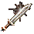 <strong>007</strong> 人马战斧 Centaur&#x27;s Axe | 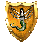 <strong>013</strong> 矮人王盾 Shield of the Dwarven Lords |  <strong>019</strong> 纯白独角盔 Helm of the Alabaster Unicorn | 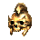 <strong>020</strong> 骷髅冠 Skull Helmet | 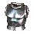 <strong>025</strong> 藤木胸甲 Breastplate of Petrified Wood |
| 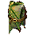 <strong>037</strong> 龙眼戒 Quiet Eye of the Dragon | 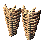 <strong>041</strong> 龙骨胫甲 Dragonbone Greaves |  <strong>045</strong> 龙眼指环 Still Eye of the Dragon |  <strong>046</strong> 幸运四叶草 Clover of Fortune |  <strong>047</strong> 预言卡 Cards of Prophecy |
| 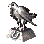 <strong>048</strong> 幸运鸟 Ladybird of Luck | 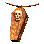 <strong>049</strong> 英勇勋章 Badge of Courage |  <strong>050</strong> 勇气勋章 Crest of Valor | 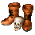 <strong>051</strong> 勇气之印 Glyph of Gallantry | 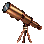 <strong>052</strong> 窥镜 Speculum |
| 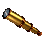 <strong>053</strong> 望远镜 Spyglass |  <strong>060</strong> 精灵木弓 Bow of Elven Cherrywood |  <strong>073</strong> 魔力神符 Charm of Mana | 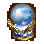 <strong>074</strong> 魔力护符 Talisman of Mana | 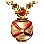 <strong>075</strong> 魔力秘球 Mystic Orb of Mana |
|  <strong>076</strong> 魔法项圈 Collar of Conjuring |  <strong>077</strong> 魔法戒 Ring of Conjuring |  <strong>078</strong> 魔法披风 Cape of Conjuring |  <strong>084</strong> 禁锢之灵 Spirit of Oppression |  <strong>085</strong> 恶运沙漏 Hourglass of the Evil Hour |
|  <strong>094</strong> 活力之戒 Ring of Vitality |  <strong>097</strong> 迅捷项链 Necklace of Swiftness | 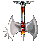 <strong>100</strong> 冷静挂件 Pendant of Dispassion |  <strong>102</strong> 神圣挂件 Pendant of Holiness |  <strong>103</strong> 生命挂件 Pendant of Life |
|  <strong>104</strong> 死亡挂件 Pendant of Death | 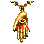 <strong>105</strong> 自由意志挂件 Pendant of Free Will | 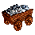 <strong>107</strong> 持久记忆挂件 Pendant of Total Recall | 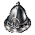 <strong>118</strong> 军团之足 Legs of Legion | 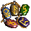 <strong>152</strong> 压制符文 Runes of Imminency |
|  <strong>153</strong> 恶魔马蹄铁 Demon&#x27;s Horseshoe | 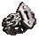 <strong>156</strong> 压抑之戒 Ring of Suppression |  |  |  |

## 三等奖 / Third Prize

**25%；500 金币 / gold；22 件 / artifacts。**

| 宝物 / Artifact | 宝物 / Artifact | 宝物 / Artifact | 宝物 / Artifact | 宝物 / Artifact |
| --- | --- | --- | --- | --- |
| 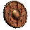 <strong>008</strong> 黑魔剑 Blackshard of the Dead Knight | 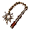 <strong>009</strong> 豺狼人连枷 Greater Gnoll&#x27;s Flail | 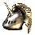 <strong>014</strong> 尖啸灵盾 Shield of the Yawning Dead |  <strong>015</strong> 豺狼王盾 Buckler of the Gnoll King | 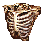 <strong>021</strong> 混沌之冠 Helm of Chaos |
| 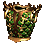 <strong>022</strong> 至高法师王冠 Crown of the Supreme Magi | 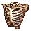 <strong>026</strong> 骨质护甲 Rib Cage | 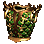 <strong>027</strong> 巨蜥蜴鳞甲 Scales of the Greater Basilisk | 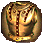 <strong>031</strong> 奇迹战甲 Armor of Wonder | 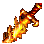 <strong>038</strong> 赤龙火舌剑 Red Dragon Flame Tongue |
|  <strong>042</strong> 龙翼袍 Dragon Wing Tabard | 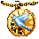 <strong>061</strong> 独角鬃弓弦 Bowstring of the Unicorn&#x27;s Mane | 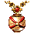 <strong>070</strong> 骑术手套 Equestrian&#x27;s Gloves | 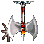 <strong>095</strong> 生命之戒 Ring of Life | 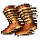 <strong>098</strong> 神行靴 Boots of Speed |
|  <strong>112</strong> 无尽矿石车 Inexhaustible Cart of Ore | 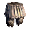 <strong>114</strong> 无尽木材车 Inexhaustible Cart of Lumber | 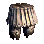 <strong>119</strong> 军团之胯 Loins of Legion | 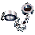 <strong>120</strong> 军团之躯 Torso of Legion | 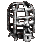 <strong>155</strong> 惊骇面具 Hideous Mask |
| 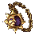 <strong>162</strong> 日蚀护符 Charm of Eclipse |  <strong>163</strong> 落日印章 Seal of Sunset |  |  |  |

## 二等奖 / Second Prize

**10%；1000 金币 / gold；40 件 / artifacts。**

| 宝物 / Artifact | 宝物 / Artifact | 宝物 / Artifact | 宝物 / Artifact | 宝物 / Artifact |
| --- | --- | --- | --- | --- |
| 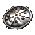 <strong>010</strong> 狂魔棒 Ogre&#x27;s Club of Havoc | 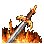 <strong>011</strong> 地狱烈焰剑 Sword of Hellfire | 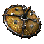 <strong>016</strong> 狂魔盾 Targ of the Rampaging Ogre |  <strong>017</strong> 邪盾  Shield of the Damned | 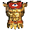 <strong>023</strong> 地狱风暴冠 Hellstorm Helmet |
| 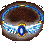 <strong>028</strong> 独眼王护身甲 Tunic of the Cyclops King | 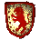 <strong>029</strong> 硫磺胸甲 Breastplate of Brimstone | 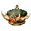 <strong>039</strong> 龙鳞盾 Dragon Scale Shield | 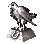 <strong>043</strong> 龙牙项链 Necklace of Dragonteeth | 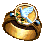 <strong>062</strong> 天羽箭 Angel Feather Arrows |
|  <strong>066</strong> 政治家勋章 Statesman&#x27;s Medal | 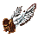 <strong>067</strong> 礼仪之戒 Diplomat&#x27;s Ring | 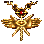 <strong>068</strong> 大使勋带 Ambassador&#x27;s Sash | 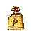 <strong>069</strong> 旅行者之戒 Ring of the Wayfarer |  <strong>079</strong> 苍穹之球 Orb of the Firmament |
| 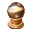 <strong>080</strong> 淤泥之球 Orb of Silt |  <strong>081</strong> 烈焰之球 Orb of Tempestuous Fire |  <strong>082</strong> 豪雨之球 Orb of Driving Rain |  <strong>091</strong> 黄金弓 Golden Bow |  <strong>092</strong> 永恒之球 Sphere of Permanence |
|  <strong>096</strong> 活力血瓶 Vial of Lifeblood |  <strong>099</strong> 极速披风 Cape of Velocity |  <strong>101</strong> 第二视线挂件 Pendant of Second Sight |  <strong>106</strong> 负极挂件 Pendant of Negativity |  <strong>108</strong> 勇气挂件 Pendant of Courage |
|  <strong>109</strong> 无尽水晶披风 Everflowing Crystal Cloak |  <strong>110</strong> 无尽宝石戒指 Ring of Infinite Gems |  <strong>111</strong> 无尽水银瓶 Everpouring Vial of Mercury |  <strong>113</strong> 无限硫磺指环 Eversmoking Ring of Sulfur |  <strong>116</strong> 无尽黄金袋 Endless Bag of Gold |
|  <strong>117</strong> 无尽黄金包 Endless Purse of Gold |  <strong>121</strong> 军团之臂 Arms of Legion |  <strong>122</strong> 军团之首 Head of Legion |  <strong>125</strong> 战争枷锁 Shackles of War |  <strong>147</strong> 统御三叉戟 Trident of Dominion |
|  <strong>148</strong> 海军荣耀之盾 Shield of Naval Glory |  <strong>149</strong> 皇家海妖战甲 Royal Armor of Nix |  <strong>150</strong> 七海之冠 Crown of the Five Seas |  <strong>151</strong> 远行者长靴 Wayfarer&#x27;s Boots |  <strong>157</strong> 堕落坠饰 Pendant of Downfall |

## 一等奖 / First Prize

**5%；2000 金币 / gold；17 件 / artifacts。**

| 宝物 / Artifact | 宝物 / Artifact | 宝物 / Artifact | 宝物 / Artifact | 宝物 / Artifact |
| --- | --- | --- | --- | --- |
|  <strong>012</strong> 泰坦短剑 Titan&#x27;s Gladius |  <strong>018</strong> 守护神之盾 Sentinel&#x27;s Shield |  <strong>024</strong> 雷电头盔 Thunder Helmet |  <strong>030</strong> 泰坦战甲 Titan&#x27;s Cuirass |  <strong>032</strong> 圣靴 Sandals of the Saint |
|  <strong>033</strong> 天国祝福项链 Celestial Necklace of Bliss |  <strong>034</strong> 勇气狮盾 Lion&#x27;s Shield of Courage |  <strong>035</strong> 审判之剑 Sword of Judgement |  <strong>036</strong> 神谕之冠 Helm of Heavenly Enlightenment |  <strong>040</strong> 龙鳞甲 Dragon Scale Armor |
|  <strong>044</strong> 龙牙冠 Crown of Dragontooth |  <strong>072</strong> 天使之翼 Angel Wings |  <strong>088</strong> 水系魔法书 Tome of Water Magic |  <strong>115</strong> 无尽黄金囊 Endless Sack of Gold |  <strong>138</strong> 巫师之井 Wizard&#x27;s Well |
|  <strong>139</strong> 法师之戒 Ring of the Magi |  <strong>164</strong> 光逝战甲 Plate of Dying Light |  |  |  |

## 特等奖 / Special Prize

**1%；4000 金币 / gold；17 件 / artifacts。**

| 宝物 / Artifact | 宝物 / Artifact | 宝物 / Artifact | 宝物 / Artifact | 宝物 / Artifact |
| --- | --- | --- | --- | --- |
|  <strong>086</strong> 火系魔法书 Tome of Fire Magic |  <strong>087</strong> 气系魔法书 Tome of Air Magic |  <strong>089</strong> 土系魔法书 Tome of Earth Magic |  <strong>093</strong> 弱点之球 Orb of Vulnerability |  <strong>124</strong> 魔法师之帽 Spellbinder&#x27;s Hat |
|  <strong>128</strong> 末日之刃 Armageddon&#x27;s Blade |  <strong>129</strong> 天使联盟 Angelic Alliance |  <strong>131</strong> 长生灵药 Elixir of Life |  <strong>132</strong> 诅咒铠甲 Armor of the Damned |  <strong>133</strong> 军团雕像 Statue of Legion |
|  <strong>134</strong> 龙父神力 Power of the Dragon Father |  <strong>135</strong> 泰坦之雷 Titan&#x27;s Thunder |  <strong>137</strong> 狙击弓 Bow of the Sharpshooter |  <strong>140</strong> 丰收之角 Cornucopia |  <strong>141</strong> 外交官斗篷 Diplomat&#x27;s Cloak |
|  <strong>143</strong> 食人魔铁拳 Ironfist of the Ogre |  <strong>160</strong> 金鹅 Golden Goose |  |  |  |

---

[返回完整规则 / Back to the complete rules](SPECIAL_MECHANICS.md#奥蕾加寻宝术--olega-treasure-hunt)
